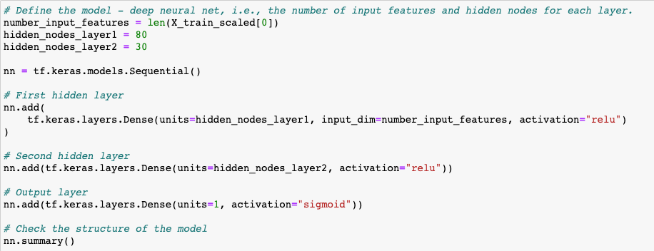
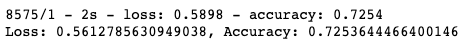
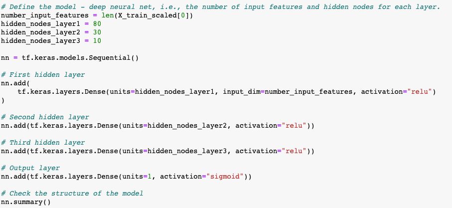
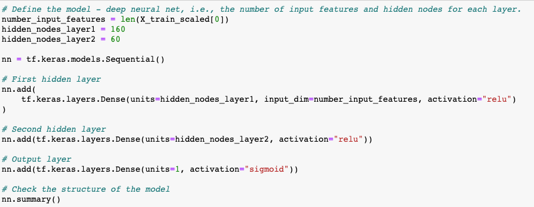
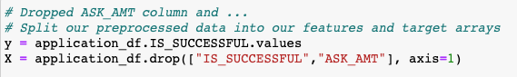
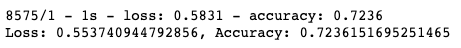
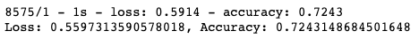
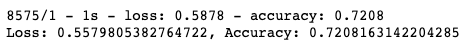

# Neural Network Charity Analysis

## Overview

There was a need to create a binary classifier that is capable of predicting whether applicants will be successful if funded by a company, Alphabet Soup.

A CSV was received from Alphabet Soup's business team, containing more than 34,000 organizations that have received funding from Alphabet Soup over the years. Within this dataset are a number of columns that capture metadata about each organization.

This assignment consists of the following three technical analysis deliverables:

- Deliverable 1: Preprocessing Data for a Neural Network Model
- Deliverable 2: Compile, Train, and Evaluate the Model
- Deliverable 3: Optimize the Model

## Results

### Data Preprocessing

- Variables that were considered the target for the model:
    - IS_SUCCESSFUL: This variable captured whether the money was used effectively by a recipient.

- Variables that were considered to be the features for the model:

    - APPLICATION_TYPE: Alphabet Soup application type
    - AFFILIATION: Affiliated sector of industry
    - CLASSIFICATION: Government organization classification
    - USE_CASE: Use case for funding
    - ORGANIZATION: Organization type
    - STATUS: Active status
    - INCOME_AMT: Income classification
    - SPECIAL_CONSIDERATIONS: Special consideration for application
    - ASK_AMT: Funding amount requested

- Variables that were neither considered targets or features because they weren't beneficial to the model, and were removed from the input data:
    - EIN: Identification column
    - NAME: Identification column

### Compiling, Training, and Evaluating the Model

- The number of neurons, layers, and activation functions that were selected for the neural network model, and why?

    For the original model, two hidden layers were chosen, with 80 neurons in the first and 30 neurons in the second. The Relu function was used in the two hidden layers, and the Sigmoid function in the Output layer. These were hypothesized to be the most effective to increase performance of the model.

    

- Was target model performance achieved?

    The target model performance was not achieved. The accuracy was 0.7254 (72.54%).

    

- What steps were taken to try and increase model performance?

    The following three attempts were made at optimizing the model:

    - 1. Adding a third hidden layer
    

    - 2. Doubling the number of neurons to the original two hidden layers
    

    - 3. Dropping the ASK_AMT column
    

## Summary

The overall results of the original and three optimization versions of the deep learning model did not reach the target model peformance of 75% accuracy. Here are the details:

- 0. Original model: 0.7254 (72.54%) accuracy

- 1. Adding a third hidden layer: 0.7236 (72.36%) accuracy

- 2. Doubling the number of neurons to the original two hidden layers: 0.7243 (72.43%) accuracy

- 3. Dropping the ASK_AMT column: 0.7208 (72.08%) accuracy

It's recommended that more drastic variations be explored, such as bigger variations in the number of layers, neurons and activation functions, to reach the 75% threshold.

